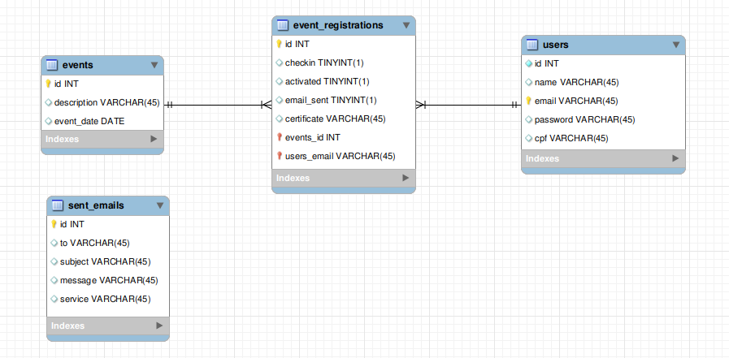

# Microserviços

Este repositório contém o código desenvolvido para o componente de Arquiteturas de Software da graduação de Engenharia de Software na Univates.

## Solução

A solução consiste em ter vários microserviços realizando uma função. Então, toda a aplicação foi quebrada em vários projetos para rodarem sem dependência, conforme a arquitetura abaixo.

Todo o projeto foi desenvolvido usando PHP (Laravel e Lumen), Java na aplicação desktop e containers para executar em produção. Além disso, o banco utilizado foi o MySQL (MariaDB).

### Arquitetura

#### Aplicação

#### Banco de dados

Modelo do banco do servidor

Modelo do banco da aplicação desktop

### Casos de uso

## Tarefa

A partir dos conceitos de microsserviços, vamos realizar uma implementação com base no tema a
seguir. Primeiramente, faremos um mapeamento da solução, em seguida, uma implementação.

### Tema: Sistema de Eventos
Imaginemos um pequeno sistema para gerência de eventos. Os usuários podem acessar o portal, pesquisar
por eventos disponíveis e inscrever-se. Após a inscrição, é permitido ao usuário consultar suas inscrições
e também cancelar, desde que dentro do período aceitável para cancelamento.
Ao comparecer no evento, os atendentes realizam o checkin dos participantes. Um participante não
inscrito pode fazer checkin mediante um cadastro básico e rápido na portaria do evento. Os dados
completos desse usuário devem ser preenchidos posteriormente por ele no próprio sistema.
Após o encerramento do evento é permitido aos usuários emitir seu certificado de participação. Para isso,
é fornecida uma interface ao usuário onde são listados todos os eventos que o mesmo participou,
permitindo seleção de geração de certificado. Ainda sobre os certificados, esses possuem um código
único de autenticação impresso no próprio documento, acompanhado de um endereço para validação
digital desse certificado.
O sistema envia e-mail a cada atividade que altere dados no sistema de inscrições, sejam elas: inscrição,
cancelamento, comparecimento e emissão de certificado.

Principais funções a observar e modularizar
1. Cadastro do usuário
2. Login
3. Inscrição completa
4. Consulta de inscrição
5. Cancelamento de inscrição
6. Registro de presença
7. Inscrição rápida
8. Emissão de certificado
9. Validação do certificado
10. Envio de e-mail

Observações

* Pensem em um cadastro simplificado
* Período de cancelamento é uma regra de negócio, nesse caso, padronizem 2 dias
* Cada evento tem um template para certificado
* O sistema de checkin precisa funcionar offline. Uma aplicação desktop será necessária ou algo
similar
* O cadastro de eventos e demais cadastros de apoio não necessitam interface, podem ser
alimentados via banco de dados

Detalhamento

* Mapear uma arquitetura que atenda ao problema proposto. Elaborar um esquema que represente o
modelo da arquitetura-solução. Identificar:
  * Tecnologias lógicas: linguagens de programação, bibliotecas, banco de dados, dentre
outros
  * Hardware: máquina física, virtual ou contêiner
* Modelos:
  * Modelo a arquitetura da solução
  * Diagrama de Casos de Uso
  * Modelo do Banco de Dados
* Controle de acesso
  * Deve existir um Gateway que recebe as conexões e direciona para os respectivos serviços
  * Implementar um registro de logs de tudo que trafega pelo Gateway
  * Acesso das requests deve ser autenticado
* Testagem
  * Teste de todo o fluxo do negócio de eventos
  * Testes de carga que demonstrem o desempenho do Gateway e o ponto de colapso